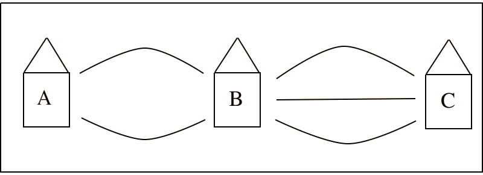

.. _combinatorics:

=============
Combinatorics
=============

**Combinatorics** is the study of sequences and the order in which they occur.

.. _fundamental_counting_principles:

Definitions
=============

.. glossary::
    Power Set
        The *Power Set* of a set **A**, denoted :math:`\mathcal{P}(A)`, is the set of all subsets of **A**.

        .. warning::
            :math:`\forall B: B \subseteq A \implies B \in \mathcal{P}(A)`

    Sequences
        An ordered set of numerical elements. The i :sup:`th` element of a sequence is called the i :sup:`th` term of the sequence

        .. warning::
            :math:`G = \{ \forall x \in E, y \in F: xy \}` 

Fundamental Counting Principles
===============================

Motivation
----------

Suppose you live in the aptly named *Town A* and are planing a road trip to the similarly uninspired *Town C*. You plan on stopping at *Town B* to fill up your gas tank before proceeding to *Town C*.

Suppose further there are two routes from *Town A* to *Town B*, and there are three routes from *Town B* to *Town C*, depicted below.

How many routes can you take from *Town A* to *Town B*, and then from *Town B* to *Town C*?

Before toggling the answer below, try and figure out the answer by drawing arrows from *Town A* to *Town B*, and then from *Town B* to *Town C* that represent the possible routes you could take, and counting up all possible answers. In other worlds, generate a :ref:`sample_space` for this "experiment".

.. collapse:: Solution

    We start by breaking down the problem into the choices we are making. Starting in *Town A*, we have two possible routes from which we can choose to get to *Town B*. Once we arrive in *Town B*, regardless of the route we took to get there, we then have three possible routes to choose from that lead from*Town B* to *Town C*.

    Each choice represents a branch. Every time we make a choice, we are narrowing down the set of possible outcomes. We need a way of visualizing the space of possible routes that captures this feature. We can represent each choice as a *branch* in a tree, as in the following example.

    .. image:: ../../imgs/combinatorics_tree_diagram.png
        :width: 60%
        :align: center

    The number of possible routes is equal to the number of endpoints in graph pictured above. In this case, 8. 
    
    These types of graphs are called :ref:`tree diagrams <tree_diagrams>`. They are very useful for visualizing the sample spaces of experiments that are composed of successive, independent choices, as in this example. 

.. _counting_principle:

The Counting Principle
----------------------

We now generalize the example in the previous section into the *Counting Principle*, using the language of :ref:`Set Theory<set_theory>`.

Proposition

    Let the sets **E** and **F** have cardinalities *n* and *m*. Let **G** be the set of sequences *xy* formed by first selecting an element *x* from **E** and then an element *y* from **F**. Then, the cardinality of **G** is :math:`n \cdot m`

.. note:: Careful! 
    The element *xy* is **not** the product of *x* and *y*, i.e *x* times *y*. It is a *sequence* of letters *xy*. That becomes more obvious if we let :math:`E = \{ a, b, c \}` and :math:`F=\{d, e , f\}`; then **G** is the set of sequences :math:`G = \{ ad, ae, af, bd, be, bf, cd, ce, cf \}`. Take note that :math:`n(E)=3`, :math:`n(F)=3`, so therefore :math:`n(G) = n(E) \cdot n(F) = 3 \cdot 3 = 9`

.. note:: Try It Yourself
    
    You are trying to figure out what to outfit to wear. In your closet, you have a red, green, blue and orange shirt. In your dresser, you have a pair of blue jeans, a pair of khakis and a pair of sweat pants. How many possible choices do you have for your outfit?

.. collapse:: Solution
    
    We have two sets in this problem: the set of shirts in our closet, and the set of pants in our dresser. 

    .. image:: ../../imgs/combinatorics_example.png
        :width: 60%
        :align: center

    The first set contains four elements and the second set contains three elements. Therefore, 
.. warning::

    We state the hypothesis and conclusion of the **Counting Principle** in precise symbols below,

        .. :math::
            n(E) = n \land n(F) = m
        .. :math::
            G = \{ \forall x \in E \land y \in F: xy \}
        .. :math::
            \implies n(G) = n(E) \cdot n(F)

.. _tree_diagrams:

Tree Diagrams
-------------

TODO 

.. _generalized_counting_principle:

Generalized Counting Principle
------------------------------

TODO 

Permutations
============

Motivation
----------

Three of your friends, Aletheia, Bertha and Cornelius, are running a foot race to determine who is the fastest. As a diligent statistician, rather than participate in the festitivities, you decide to turn into a bookie and take bets from your other friends on who is going to win the race. In order to assign odds to each outcome, you first have to know *how many ways* the race can finish.   

How many ways can this race between Aletheia, Bertha and Cornelius finish? Before toggling the solution below, try and figure out the answer by listing each possible outcome and then totaling the results.

.. collapse:: Solution

    TODO