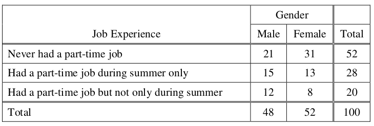
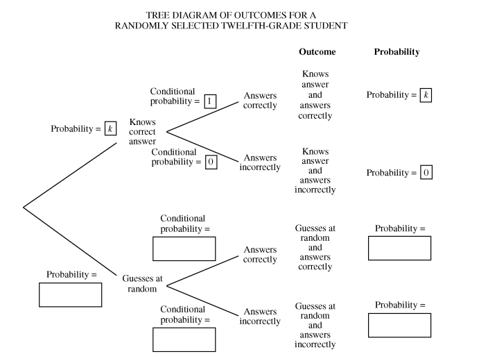
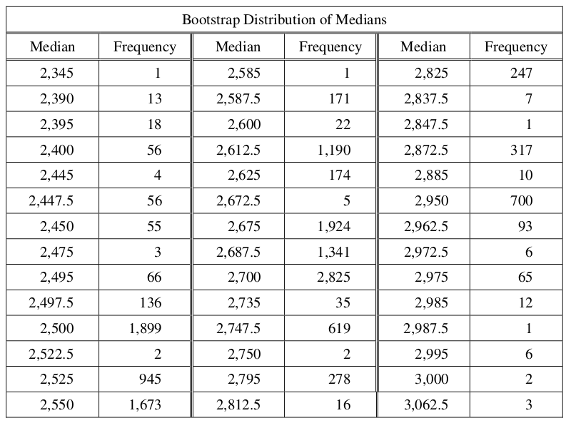

.. _celebration_statistics_four:

========================
Statistics: Quarter Four
========================

Celebration of Knowledge
========================

1. **2009, Free Response, #1**

A simple random sample of 100 high school seniors was selected from a large school district. The gender of each student was recorded, and each student was asked the following questions.

	1. Have you ever had a part-time job?

	2. If you answered yes to the previous question, was your part-time job in the summer only?

The results are summarized in the following table,

	
Use this information to answer the following questions.

	a. Construct a graphical display that represents the association between gender and job experience for the students in the sample.

	b. Write a few sentences summarizing what the display in part (a) reveals about the association between gender and job experience for the students in the sample.

	c. Which test of significance should be used to test if there is an association between gender and job experience for the population of high school seniors in the district? State the null and alternative hypotheses for the test, but do not perform the test.

2. **2011, Free Response, #6**

Every year, each student in a nationally representative sample is given tests in various subjects. Recently, a random sample of 9,600 twelfth-grade students from the United States were administered a multiple-choice United States history exam. One of the multiple-choice questions is below. (The correct answer is C.)

.. topic:: United States History Exam Question
	
	In 1935 and 1936 the Supreme Court declared that important parts of the New Deal were unconstitutional. President Roosevelt responded by threatening to

		A. impeach several Supreme Court justices

		B. eliminate the Supreme Court
		
		C. appoint additional Supreme Court justices who shared his views.
		
		D. override the Supreme Court's decision by gaining three-fourths majorities in both houses of Congress.

Of the 9,600 students, 28 percent answered the multiple-choice question correctly.

	a. Let *p* be the proportion of all United States twelfth-grade students who would answer the question correctly. Construct and interpret a 99 percent confidence interval for *p*.
	
Assume that students who actually know the correct answer have a 100 percent chance of answering the question correctly, and students who do not know the correct answer to the question guess completely at random from among the four options.

Let *k* represent the proportion of all United States twelfth-grade students who actually know the correct answer to the question.

	b. A tree diagram of the possible outcomes for a randomly selected twelfth-grade student is provided below. Write the correct probability in each of the five empty boxes. Some of the probabilities may be expressions in terms of *k*.
	

Use the completed tree diagram to answer the following problems.

	c. Based on the completed tree diagram, express the probability, in terms of *k*, that a randomly selected twelfth-grade student would correctly answer the history question.

	d. Using your interval from *part a* and your answer to *part c*, calculate and interpret a 99 percent confidence interval for *k*, the proportion of all United States twelfth-grade students who actually know the answer to the history question. You may assume that the conditions for inference for the confidence interval have been checked and verified.
	
3. **2019, Free Response, #6**

Emma is moving to a large city and is investigating typical monthly rental prices of available one-bedroom apartments. She obtained a random sample of rental prices for 50 one-bedroom apartments taken from a Web site where people voluntarily list available apartments.

	a. Describe the population for which it is appropriate for Emma to generalize the results from her sample.
	
The distribution of the 50 rental prices of the available apartments is shown in the following histogram.

.. image:: ../../assets/imgs/classwork/2019_apstats_frp_06a.png
	:align: center
	
Use this histogram to answer the following questions.

	b. Emma wants to estimate the typical rental price of a one-bedroom apartment in the city. Based on the distribution shown, what is a disadvantage of using the mean rather than the median as an estimate of the typical rental price?
	
	c. Instead of using the sample median as the point estimate for the population median, Emma wants to use an interval estimate. However, computing an interval estimate requires knowing the sampling distribution of the sample median for samples of size 50. Emma has one point, her sample median, in that sampling distribution. Using information about rental prices that are available on the Web site, describe how someone could develop a theoretical sampling distribution of the sample median for samples of size 50.

Because Emma does not have the resources to develop the theoretical sampling distribution, she estimates the sampling distribution of the sample median using a process called bootstrapping. In the bootstrapping process, a computer program performs the following steps,

- Take a random sample, with replacement, of size 50 from the original sample.
- Calculate and record the median of the sample.
- Repeat the process to obtain a total of 15,000 medians.

Emma ran the bootstrap process, and the following frequency table is the bootstrap distribution showing her results of generating 15,000 medians.

	
The bootstrap distribution provides an approximation of the sampling distribution of the sample median. A confidence interval for the median can be constructed using a percentage of the values in the middle of the bootstrap distribution.

	d. Use the frequency table to find the following.
	
		i. Value of the 5th percentile:
		
		ii. Value of the 95th percentile:

	e. Find the percentage of bootstrap medians in the table that are equal to or between the values found in *part d*.
	
	f. Use your values from *parts d* and *e* to construct and interpret a confidence interval for the median rental price.

