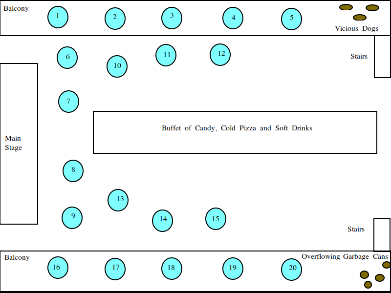

===========================
Sejal's Sadistic Statistics
===========================

.. warning::

	You are about to have a *dangerous* amount of fun.

Instructions
------------

.. note::

	On March 14th, 2024, everyone bore witness to Sejal demanding more problems to do over Spring Break. I have obliged her request. Be sure to let her know how you feel about having to do these problems for homework!
	
Sejal has invited you to attend the annual *Ghimire Statistics Gala*. Unfortunately, you cannot think of a good enough excuse on the spot to get out of going, so you are obligated to attend. As part of the celebration, you are required to solve the following problems. Luckily, you brought your handy-dandy homework notebook, so be sure to complete the problems in there.

.. topic:: Due Date

	April 8th, 2024
	
	(The day we come back from break)

Problems
--------

Chapters 1, 2, 4: Statistics
****************************

1. **Skittles**

The *Ghimire Statistics Gala* is known throughout the tristate region as a cultural epicenter for gourmet cuisine and fine food. Sejal is preparing the menu for this year's gala. 

Every year, the guests feast upon a smorgasboard of candy, cold pizza and soft drinks. As a diligent statistics student, Sejal wants to buy the correct amount of Skittles for all of her guests. The amount in pounds of Skittles consumed each year by the attendees is given in the following table,

+----------+--------------------------------+
|   Year   |   Pounds of Skittles Consumed  |
+----------+--------------------------------+
|  2023    |            7.5                 |
+----------+--------------------------------+
|  2022    |            6.9                 |
+----------+--------------------------------+
|  2021    |            1.5                 |
+----------+--------------------------------+
|  2020    |            1.2                 |
+----------+--------------------------------+
|  2019    |            7.2                 |
+----------+--------------------------------+
|  2018    |            6.8                 |
+----------+--------------------------------+
|  2017    |            6.2                 |           
+----------+--------------------------------+
|  2016    |            6.6                 |
+----------+--------------------------------+
|  2015    |            6.5                 |
+----------+--------------------------------+
|  2014    |            5.9                 |
+----------+--------------------------------+
|  2013    |            5.8                 |
+----------+--------------------------------+

Use this information to answer the following questions.

	a. Create a histogram and boxplot to visualize this distribution. Use 6 classes for the histogram. Describe the distribution in a few sentences. 

	b. Create a cumulative frequency distribution and use it to create an ogive (i.e., a *cumulative distribution function*, or simply, **CDF**). Based on the CDF, approximately how many pounds of Skittles should Sejal order if she wants to be 70% sure she has ordered the correct amount?
	
	c. Find the mean and median for the amount of Skittles consumed every year at the *Ghimire Statistics Gala*.
	 
	d. Which is the best estimate for the amount of Skittles in pounds Sejal should purchase for this year's *Ghimire Statistics Gala*, the mean or median? Why? Justify your answer. 

	e. Calculate and interpret the standard deviation of the amount of Skittles consumed every year at the *Ghimire Statistics Gala*.
	
	f. How many standard deviations away from the mean are the two observations from 2020 and 2021?
	
	g. Based on the IQR rule for outliers, are there any potential outliers in this sample? 
	
	h. Unfortunately, Sejal discovers orders for the Mars Candy Company (the manufacturer of Skittles) must be submitted in ounces, not pounds! Therefore, Sejal has to convert all her estimates to ounces. If there are 16 ounces in a pound, how will this change the answers to *part c* and *part e*?
	
2. **Dinner Arrangements**

Sejal wants to survey the guests at the annual *Ghimire Statistics Gala* to determine what proportion of people are enjoying the festivities. To accomplish this, she will leave 20 comment cards at random places on the dinner tables for people to fill out. The comment cards will read,

	Name: ___________
	
	Are you having fun at the *Ghimire Statistics Gala*?
	
	- Yes
	- No

The diagram below shows the floor plan for the gala,

The numbered blue circles represent tables. Each table seats 4 people. The seats are first come, first serve.

	a. Describe step-by-step a sampling process Sejal could use to select a simple random sample of guests for her survey. 
	
	b. Describe step-by-step a *stratified* sampling process Sejal could use to select a sample of guests for her survey. Give a statistical justification for the strata used.
	
	c. Describe a *clustered* sampling process Sejal could use to select a sample of guests for her survey. Give a statistical justification for the clusters used.
	
	d. Which sampling method, *part b* or *part c* would be better for the indicated floor plan? Why? Give a statistical justification. 
	
	e. As Sejal's trusted statistics advisor, she calls you up to discuss the experimental design of her survey. What are some potential sources of bias in Sejal's survey? What suggestions would you make to improve the accuracy of her results? 

Chapter 3: Regression
*********************

1. **Competition**

Mr. Moore's competing *Not For Losers Statistics Gala* has been a thorn in the side of the annual *Ghimire Statistics Gala* since it began several years ago, stealing guests who prefer Mr. Moore's chef catered buffet, where guests may dine on such delicacies as escargo and ratatouille, among other dishes. 

To combat Mr. Moore's upstart gala, Sejal budgets a certain amount of money to advertising in order to promote awareness of the *Ghimire Statistics Gala*. She has been tracking the amount of money she spends on advertising versus the number of attendees at Mr. Moore's Gala since it began. Her data are given in the table below,

+----------------------------+-----------------------------+
| Sejal's Advertising Budget | Mr. Moore's Gala Attendance |
+----------------------------+-----------------------------+
|          $25               |            76               |
+----------------------------+-----------------------------+
|         $275               |            42               |
+----------------------------+-----------------------------+
|         $100               |            55               |
+----------------------------+-----------------------------+
|         $320               |            36               |
+----------------------------+-----------------------------+
|          $56               |            67               |
+----------------------------+-----------------------------+

Use this information to answer the following questions.

	a. Create a scatter plot of this data. Describe the relationship you observe.
	
	b. Find the linear regression equation. Plot it on top of the scatter plot you created in *part a*.
	
	c. Interpret the slope of the linear regression model in the context of the problem. 
	
	d. Does the intercept of the linear regression model have an interpretation for this problem? If so, what is that interpretation? If not, why not?
	
	e. If Sejal spends $150 on advertising this year, how many guests should she expect to attend Mr. Moore's *Not For Losers Statistics Gala*?
	
	f. If Sejal spends $400 on advertising this year, how many guests should she expect to attend Mr. Moore's *Not For Losers Statistics Gala*?
	
	g. Which prediction, *part d* or *part e*, is more reasonable? Why?
	
	h. What is the correlation between Mr. Moore's attendance and Sejal's advertising budget? 
	
	i. How much of the variation in Mr. Moore's attendance is explained by Sejal's advertising budget? 

2. **Arrival**

The doors for the annual *Ghimire Statistics Gala* open at precisely 7 pm. On her clipboard, Sejal keeps track of how many guests arrive each minute after opening the door,

+--------------------------+-------------------------+
| Minutes After Door Opens |     Guests Arriving     |
+--------------------------+-------------------------+
|          1               |       24                |
+--------------------------+-------------------------+
|          2               |       20                |
+--------------------------+-------------------------+
|          3               |       13                |
+--------------------------+-------------------------+
|          4               |        7                |
+--------------------------+-------------------------+
|          5               |        5                |
+--------------------------+-------------------------+
|          6               |        1                |
+--------------------------+-------------------------+

For example, the first row says 24 guests arrived in the first minute, the second row says 20 guests arrived in the second minute, etc.

The table below gives the output from running *minitab*'s linear regression program on this data,
	

Use this information to answer the following questions.

	a. How much of the variation in the guests' arrival can be explained by the number of arriving guests' linear dependence on time?

	b. How much of the variation in the guests' arrival can *not* be explained by the number of arriving guests' linear dependence on time?
	
	c. What is the slope of the linear regression model? Interpret the slope in context.
	
	d. Find the residual for the number of guests arriving during the second minute after the doors open. Interpret this residual in the context of the problem.
	 
Chapter 5: Probability
**********************

1. **Double Sided Coins**

Once all the guests have arrived and seated themselves, the festivities begin. Sejal saunters onto stage and picks you out of the audience to assist in her show.

Sejal places three coins into a magical probability box. Two of the coins are normal coins. The third coin is a double-sided coin with two heads. Sejal forces you to choose one of the coins at random and without looking at which coin you have chosen, flip it. If the coin lands on heads, what is the probability you have selected the double-sided coin?

.. hint::

	Draw a *conditional probability* tree diagram!

2. **Colored Balls**

Sejal empties her magical probability box and readies it for the next experiment. In this experiment, the box contains a yellow ball, an orange ball, a green ball, and a blue ball. You are forced to randomly select 4 balls from the box with replacement. What is the expected number of distinct colored balls you will select?

.. hint::

	Consider the random variable,  
	
	.. math::
		
		\mathcal{X}_\text{yellow} \sim \text{number of yellow balls drawn}
		
	What type of distribution does :math:`\mathcal{X}_\text{yellow}` have? Based on this distribution, what is :math:`E(\mathcal{X}_\text{yellow})`?
	
	Then consider the random variable,
	
	.. math::
	
		\mathcal{T} =  \mathcal{X}_\text{yellow} + \mathcal{X}_\text{orange} + \mathcal{X}_\text{green} + \mathcal{X}_\text{blue}
		
	What is :math:`E(\mathcal{T})`?   

3. **Sejal's Folly**

Sejal, now bored with her magical probability box, haphazardly discards it and decides everyone will have more fun if they all play a game together. *Sejal's Folly* is a gambling game often played at the *Ghimire Statistics Gala*. Each player may bet on any of the numbers :math:`1,2,3,4,5,6`. Three dice are then rolled. If the player's number appears on one, two or three of the dice, he or she receives respectively, one, two or three times their original bet, plus their original money back. Otherwise, the bet is lost. What is the player's expected loss per bet?

4. **Craps**

After the folly of *Sejal's Folly*, Sejal decides to play a more traditional game with everyone, *Craps*. The rules for *Craps* are as follows: Two die are rolled and the sum of the outcomes is calculated for each roll. The player rolls the dice and wins at once if the sum for the first throw is 7 or 11. The player loses at once if the sum is 2, 3 or 12. Any other roll is called the *point*. If the first throw is a point, the player rolls the dice repeatedly until either winning by rolling the *point* again, or loses by rolling a 7. What is your probability of winning at Sejal's Craps table?

5. **Counterfeiting**

What luck! You won $10000 playing Craps! But now Sejal owes you $10000! Because you are good friends, you let her pay you back over time and devise a payment plan, where Sejal will pay you $100 a month for the next 100 months. Sejal, however, decides to cheat you out of your winnings by paying entirely in one dollar bills and inserting a single counterfeit bill into each payment (i.e. $99 is real and $1 is fake). Considering your long and storied history with Sejal, you immediately suspect deception. You randomly select a single dollar from each payment and subject it to rigorous counterfeit testing. If your counterfeit testing procedure works 100% of the time, what is the probability you will discover a counterfeit bill before Sejal completes her payments?

6. **The Hat Game**

Sejal puts a stop to the gambling, lest she lose more money. Instead, she decides everyone should play a more festive game. Three attendees of the Sejal's *Statistics Gala* students are seated in a circle and made to play this fun probability game. Sejal flips a coin for each person and based on the outcome of the flip, places either a red or blue hat on each participants' head. No communication of any sort is allowed between the the participants, except for an initial strategy session before the game begins. During this strategy session, they are not allowed to ask what color hat they are wearing or tell the others what color hat they are wearing. Once the strategy session is over, the players must *simultaneously* guess the color of their own hats or pass. What group strategy should they adopt to maximize the probability that atleast one person guesses correctly and no-one guesses incorrectly?

The naive strategy would be for the group to agree that one person should guess and the others should pass. This would have probability of success equal to :math:`\frac{1}{2}`. Find a strategy with a greater chance for success. What is the probability of success with your strategy?

.. hint::

	This is a famous probability problem from a column entitled *Why Mathematicians Now Care About Their Hat Color*, New York Times, Science Times, D5, April 10, 2001.

.. hint::

	What are the possible sequences of hat colors? 
	
.. hint::

	This one is quite hard. I suggest organizing an impromptu gathering to actually play this game. It will help you understand what types of strategies work and do not work.
	
7. **Quadratic Equation**

After several complaints from distraught guests about the complexity of the games on offer, Sejal goes back to the basics and rolls out a chalkboard. She writes on the chalkboard the following equation,

.. math::

	x^2 + b \cdot x + c = 0
	
Then, Sejal rolls two die. The outcome of the first die roll is substituted into the above equation for :math:`b`. The outcome of the second die roll is substituted into the above equation for :math:`c`. What is the probability this equation has a real root? 

Chapter 6: Random Variables
***************************

1. **Dubious Claims**

After tallying up the results of her survey from #2 in the **Chapter 1, 2 & 4: Statistics** section (by herself, without any witnesses), Sejal claims 90% of people who attended the annual *Ghimire Statistics Gala* have a fun time. You decide to test this claim by asking attendees whether or not they are having fun. Assume each attendee's having of "fun" is independent from all other attendees.  

	a. If Sejal's claim is true, what is the probability the first person who is having fun will be the third person you ask?
	
	a. You ask a total of 10 attendees whether or not they are having fun. If Sejal's claim is true, what is the probability of observing at most 3 people in your sample that are having fun? 
	
	b. After tallying up your sample, you discover exactly 3 people are having fun. Does this provide convincing evidence Sejal's claim is not true? Why or why not?

2. **Showdown**

300 people have been invited to the annual *Ghimire Statistics Gala*. From past data, Sejal estimates the probability a single invited person will attend the gala is 0.25. 

350 people have been invited to the Mr. Moore's *Not For Losers Statistics Gala*. From past data, Sejal estimates the probability a single invited person will attend the gala is 0.20. 

Let :math:`\mathcal{S}` represent the number of people who attend the annual *Ghimire Statistics Gala*. 

Let :math:`\mathcal{M}` represent the number of people who attend Mr. Moore's *Not For Losers Statistics Gala*.

	a. What type of distribution does :math:`\mathcal{S}` have? What are the parameters of this distribution?
	
	b. What type of distribution does :math:`\mathcal{M}` have? What are the parameters of this distribution?
	
	c. Verify :math:`\mathcal{S}` and :math:`\mathcal{M}` can be approximated with the Normal Distribution.
	
	d. What are the parameters of the distribution :math:`\mathcal{S} - \mathcal{M}`?
	
	e. What is the probability the annual *Ghimire Statistics Gala* will have more attendees than Mr. Moore's *Not For Loser Statistics Gala*? 

3. **Irish Goodbyes**

The amount of time a randomly selected guest at the *Ghimire Statistics Gala* spends at the gala before going home is normally distributed with a mean of 75 minutes and a standard deviation of 10 minutes. You and your entourage of three friends have just arrived at the gala.

	a. Find the mean and standard deviation for the average amount of time the four of you will spend at the *Ghimire Statistics Gala*.
	
	b. What is the probability the average amount of time all four of you will spend at the *Ghimire Statistics Gala* exceeds 80 minutes?  

