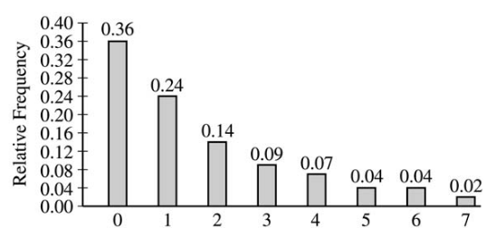

.. _binomial_distribution_classwork:

=====================
Binomial Distribution
=====================

1. **Conditions for Binomial Random Variable**

The :ref:`conditions for a Binomial Random Variable <binomial_conditions>` are given below,

.. topic:: Binomial Conditions

	1. The number of trials :math:`n` must be fixed.
	
	2. Each trial must be independent of the others.
	
	3. Each trial must have a binary outcome, usually denoted success or failure.  
	
	4. The probability of success is the same in each trial.
	
Determine whether each of the following experiments satisfies the conditions for a Binomial Random Variable. If it does not satisfy the conditions for a Binomial Random Variable, state which condition is violated and why.

	a. A student is taking a multiple choice quiz. The quiz has 10 questions, with four possible answers each. Each question has only one correct answer. The student randomly guesses on each question. Let
	
		.. math::
		
			\mathcal{X} = \text{number of correct guesses}
	
	Is :math:`\mathcal{X}` a Binomial Random Variable"
	
	b. A manager oversees 11 female employees and 9 male employees. They need to pick 3 of these employees to go on a business trip, so the manager places all 20 names in a hat and chooses at random. Let 
	
		.. math::

			\mathcal{X} = \text{number of female employees chosen}
		
	
	Is :math:`\mathcal{X}` a Binomial Random Variable?
	
	c. You deal yourself a hand of 5 cards from a standard deck of 52 cards. Let
	
		.. math::
			
			\mathcal{X} = \text{number of Aces dealt}
		
		
	Is :math:`\mathcal{X}` a Binomial Random Variable?
	
	d. You deal yourself a single card from a standard deck of 52 cards, place it back into the deck and reshuffle. You repeat this process 10 times. Let
	
		.. math::
		
			\mathcal{X} = \text{number of Aces dealt}
		
	
	Is :math:`\mathcal{X}` a Binomial Random Variable?

	e. `15% of the world's population has seen atleast one Star Wars film <https://www.explainxkcd.com/wiki/index.php/1769:_Never_Seen_Star_Wars>`_. You ask 20 students whether or not they have seen a Star Wars film. Let 
	
		.. math::
		
			\mathcal{X} = \text{number of people who have seen atleast one Star Wars film}
		
	Is :math:`\mathcal{X}` a Binomial Random Variable?
	
2. **Probability Density**

.. topic:: Binomial Probability Density Function

	.. math::

		P(\mathcal{X}=x) = C^{n}_{r} \cdot p^x \cdot (1-p)^{n-x}
		
Use the Binomal Probability Density Function to answer the following questions.

	a. Before performing any calculations, answer the following questions. 
	
		i. If you flip a fair coin ten times, how many heads do you expect to get on average? 
		
		ii. If you perform :math:`n` trials where each trial has a probability of success :math:`p`, how many successes do you expect to get on average? 
	
	b. If :math:`n=10` and :math:`p=0.5`, find :math:`P(\mathcal{X}=3)`.
	
	c. If :math:`n=10` and :math:`p=0.5`, find :math:`P(\mathcal{X}=4)`.
	
	d. If :math:`n=10` and :math:`p=0.5`, find :math:`P(\mathcal{X}=5)`. 
	
	e. If :math:`n=10` and :math:`p=0.5`, find :math:`P(\mathcal{X}=6)`.
	
	f. If :math:`n=10` and :math:`p=0.5`, find :math:`P(\mathcal{X}=7)`.
	
	g. Write a few sentence in plain English interpretting the results of *part b - f*. What happens to Binomial probabilities on either side of the *expected value* of the distribution as you move away from that point? What features of the distribution are apparent from the calculations performed in *parts b - f*? 

3. **Applications**

	a. Suppose that only 25% of all drivers come to a complete stop at an intersection having flashing red lights in all directions when no other cars are visible. You stand at the intersection and randomly sample 20 cars as they pass through the intersection.

		i. What is the probability at most 5 will come to a complete stop?
		
		ii. What is the probability exactly 6 will come to a complete stop?
	
		iii. What is the probability at least 7 will come to a complete stop?
		
		iv. What is the relationship between *part i - iii*? What property of probability does this illustrate?
		
		v. How many drivers in your sample do you expect to come to a complete stop?
		
	b. A multiple choice quiz consists of 10 questions. Each question has five possible answers. After procrastinating for a week and not studying, you wake up the day of the quiz and realize you have no idea which of the answers are correct, so you guess at random on each question. 

		i. What is your probability of scoring a 7 on this quiz?
		
		ii. What is your probability of passing the quiz, i.e. scoring *at least* a 7?
		
		iii. What is the expected number of answers that will be marked correct?	
		
	c. TODO

	d. TODO
	
4. **Normal Approximation**

The :ref:`normal_distribution` can be used to approximate the Binomal Distribution under certain conditions. These conditions are given below for quick reference,

.. topic:: Conditions for Binomial Approximation
   
    :math:`n \cdot p \geq 10`

    :math:`n \cdot (1 - p) \geq 10`
    
Use these conditions to determine whether the following Binomial Random Variables can be approximated with the Normal Distribution. In each case, calculate the exact Binomial probability. If the Normal approximation is applicable, calculate the approximate probability and compare it to the exact value. 

	a. TODO
	
	b. TODO
	
	c. TODO
	
	d. TODO
	
    
A.P. Exam Practice
==================

1. **2004, Free Response, #3**

At an archaeological site that was an ancient swamp, the bones from 20 brontosaur skeletons have been unearthed. The bones do not show any sign of disease or malformation. It is thought that these animals wandered into a deep area of the swamp and became trapped in the swamp bottom. The 20 left femur bones (thigh bones) were located and 4 of these left femurs are to be randomly selected without replacement for DNA testing to determine gender.

a. Let X be the number out of the 4 selected left femurs that are from males. Based on how these bones were sampled, explain why the probability distribution of X is not binomial.

.. hint:: 

    Are you selecting the femurs *with* or *without* replacement? What does this tell you about the *independence* of observations in this sample?

b. Suppose that the group of 20 brontosaurs whose remains were found in the swamp had been made up of 10 males and 10 females. What is the probability that all 4 in the sample to be tested are male?

c. The DNA testing revealed that all 4 femurs tested were from males. Based on this result and your answer from part *b**, do you think that males and females were equally represented in the group of 20 brontosaurs stuck in the swamp? Explain.

d. Is it reasonable to generalize your conclusion in part *c* pertaining to the group of 20 brontosaurs to the population of all brontosaurs? Explain why or why not.

2. **2006, Free Response Form B, #6**

Sunshine Farms wants to know whether there is a difference in consumer preference for two new juice products—Citrus Fresh and Tropical Taste. In an initial blind taste test, 8 randomly selected consumers were given unmarked samples of the two juices. The product that each consumer tasted first was randomly decided by the flip of a coin. After tasting the two juices, each consumer was asked to choose which juice he or she preferred, and the results were recorded.

a. Let *p* represent the population proportion of consumers who prefer Citrus Fresh. In terms of *p*, state the hypotheses that Sunshine Farms is interested in testing.

b. One might consider using a one-proportion z-test to test the hypotheses in part *#a*. Explain why this would not be a reasonable procedure for this sample.

c. Let X represent the number of consumers in the sample who prefer Citrus Fresh. Assuming there is no difference in consumer preference, find the probability for each possible value of X. Record the x-values and the corresponding probabilities in the table below.

.. image:: ../../../assets/imgs/classwork/2006_apstats_frp_formb_06.png
	:align: center
	
3. **2003, Free Response, #3** 

Men's shirt sizes are determined by their neck sizes. Suppose that men's neck sizes are approximately normally distributed with mean 15.7 inches and standard deviation 0.7 inch. A retailer sells men's shirts in sizes S, M, L, XL, where the shirt sizes are defined in the table below.

.. image:: ../../../assets/imgs/classwork/2003_apstats_frp_3.png
    :align: center

a. Because the retailer only stocks the sizes listed above, what proportion of customers will find that the retailer does not carry any shirts in their sizes? Show your work.

b. Using a sketch of a normal curve, illustrate the proportion of men whose shirt size is M. Calculate this proportion.

c. Of 12 randomly selected customers, what is the probability that exactly 4 will request size M ? Show your work.

4. **2007, Free Response Form B, #2**

The graph below displays the relative frequency distribution for X, the total number of dogs and cats owned per household, for the households in a large suburban area. For instance, 14 percent of the households own 2 of these pets.

Use this information to solve the following problems.

a. According to a local law, each household in this area is prohibited from owning more than 3 of these pets. If a household in this area is selected at random, what is the probability that the selected household will be in violation of this law? Show your work.

b. If 10 households in this area are selected at random, what is the probability that exactly 2 of them will be in violation of this law? Show your work.

6. **2009, Free Response, #2**

A tire manufacturer designed a new tread pattern for its all-weather tires. Repeated tests were conducted on cars of approximately the same weight traveling at 60 miles per hour. The tests showed that the new tread pattern enables the cars to stop completely in an average distance of 125 feet with a standard deviation of 6.5 feet and that the stopping distances are approximately normally distributed.

a. What is the 70th percentile of the distribution of stopping distances?

b. What is the probability that at least 2 cars out of 5 randomly selected cars in the study will stop in a distance that is greater than the distance calculated in *part a* ?

c. What is the probability that a randomly selected sample of 5 cars in the study will have a mean stopping distance of at least 130 feet?

7. **2022, Free Response, #3** 

A machine at a manufacturing company is programmed to fill shampoo bottles such that the amount of shampoo in each bottle is normally distributed with mean 0.60 liter and standard deviation 0.04 liter. Let the random variable **A** represent the amount of shampoo, in liters, that is inserted into a bottle by the filling machine.

a. A bottle is considered to be underfilled if it has less than 0.50 liter of shampoo. Determine the probability that a randomly selected bottle of shampoo will be underfilled. Show your work.

b. After the bottles are filled, they are placed in boxes of 10 bottles per box. After the bottles are placed in the boxes, several boxes are placed in a crate for shipping to a beauty supply warehouse. The manufacturing company's contract with the beauty supply warehouse states that one box will be randomly selected from a crate. If 2 or more bottles in the selected box are underfilled, the entire crate will be rejected and sent back to the manufacturing company. The beauty supply warehouse manager is interested in the probability that a crate shipped to the warehouse will be rejected. Assume that the amounts of shampoo in the bottles are independent of each other.

	i. Define the random variable of interest for the warehouse manager and state how the random variable is distributed.

	ii. Determine the probability that a crate will be rejected by the warehouse manager. Show your work.

c. To reduce the number of crates rejected by the beauty supply warehouse manager, the manufacturing company is considering adjusting the programming of the filling machine so that the amount of shampoo in each bottle is normally distributed with mean 0.56 liter and standard deviation 0.03 liter.

Would you recommend that the manufacturing company use the original programming of the filling machine or the adjusted programming of the filling machine? Provide a statistical justification for your choice.

8. **2021, Free Response, #3**

To increase morale among employees, a company began a program in which one employee is randomly selected each week to receive a gift card. Each of the company's 200 employees is equally likely to be selected each week, and the same employee could be selected more than once. Each week’s selection is independent from every other week.

a. Consider the probability that a particular employee receives at least one gift card in a 52 -week year.

	i. Define the random variable of interest and state how the random variable is distributed.
	
	ii. Determine the probability that a particular employee receives at least one gift card in a 52 -week year. Show your work.

b. Calculate and interpret the expected value for the number of gift cards a particular employee will receive in a 52 -week year. Show your work.

c. Suppose that Agatha, an employee at the company, never receives a gift card for an entire 52 -week year. Based on her experience, does Agatha have a strong argument that the selection process was not truly random? Explain your answer.
