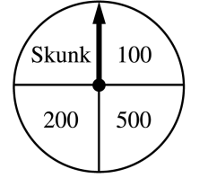
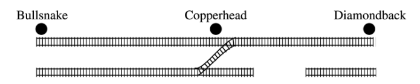

.. _random_variable_classwork:

================
Random Variables
================

Definitions
===========

.. topic:: Expectation of a Discrete Random Variable

	If :math:`\mathcal{X}` is a discrete random variable that takes on the values :math:`x_i` for :math:`i = 1, 2, 3, ..., n`, then *expectation* of :math:`\mathcal{X}` is defined as,
	
	.. math::
	
		E(\mathcal{X}) = \sum_{x_i \in \mathcal{X}(S)}{x_i \ \cdot P(\mathcal{X} = x_i) }
		
.. topic:: Variance of a Random Variable

	If :math:`\mathcal{X}` is a Random Variable, the Variance of :math:`\mathcal{X}` is given by,
	
	.. math::
	
		Var(\mathcal{X}) = E( (\mathcal{X} - E(\mathcal{X}))^2 )
		
	If the additional constraint is added that :math:`\mathcal{X}` is discrete, the *outer* expectation can be expanded and rewritten,
	
	.. math::
	
		Var(\mathcal{X}) = \sum_{x_i \in \mathcal{X}(S)}{(x_i - E(\mathcal{X}))^2  \cdot P(\mathcal{X} = x_i) }
		
	
.. topic:: Variance Shortcut Formula
	
	If :math:`\mathcal{X}` is a Random Variable, the Variance of :math:`\mathcal{X}` can be calculated with the formula,
	
	.. math::
	
		Var(\mathcal{X}) = E(\mathcal{X}^2) - (E(\mathcal{X})^2)

Introduction
============
		
1. A random variable :math:`\mathcal{X}` is defined as the number of heads in three coin flips.

	a. List the elements of the sample space for this random variable.

	b. Write the elements of the sample space that belong to the event :math:`\mathcal{X}=0` in set notation.

	c. Write the elements of the sample space that belong to the event :math:`\mathcal{X}=1` in set notation.

	d. Write the elements of the sample space that belong to the event :math:`\mathcal{X}=2` in set notation.

	e. Write the elements of the sample space that belong to the event :math:`\mathcal{X}=3` in set notation.

	f. Find the probability distribution :math:`P(\mathcal{X}=x)` for all values of *x*. 

	g. Using the probability distribution derived in *part e*, find the expectation :math:`E(\mathcal{X})` of the sum of two die rolls.

	h. Using the probability distribution derived in *part e*, find the variance :math:`Var(\mathcal{X})` of the sum of two die rolls. 

	
2. A random variable :math:`\mathcal{X}` is defined as the sum of two six-sided die rolls. 

	a. List the elements of the sample space for this random variable.

	b. Write the elements of the sample space that belong to the event :math:`\mathcal{X}=6` in set notation.

	c. Write the elements of the sample space that belong to the event :math:`\mathcal{X}=7` in set notation.

	d. Write the elements of the sample space that belong to the event :math:`\mathcal{X}=8` in set notation.

	e. Find the probability distribution :math:`P(\mathcal{X}=x)` for all values of *x*.

	f. Using the probability distribution derived in *part e*, find the expectation :math:`E(\mathcal{X})` of the sum of two die rolls.

	g. Using the probability distribution derived in *part e*, find the variance :math:`Var(\mathcal{X})` of the sum of two die rolls. 

3. The probability distribution for :math:`\mathcal{X} = \text{number of major defects on a randomly selected toaster oven}` is given by the following table,

+-------+--------+
|  x    |  p(x)  |
+-------+--------+
|   0   |  0.08  |
+-------+--------+ 
|   1   |  0.15  |
+-------+--------+ 
|   2   |  0.45  |
+-------+--------+ 
|   3   |  0.27  |
+-------+--------+ 
|   4   |  0.05  |
+-------+--------+ 
 
Compute the following:

	a. :math:`E(\mathcal{X})`

	b. :math:`Var(\mathcal{X})` directly from the definition.

	c. :math:`Var(\mathcal{X})` from the shortcut formula.

	d. :math:`\sigma_{\mathcal{X}}`

5. Suppose three cards are drawn from an ordinary deck of 52 cards, one by one, at random and with replacement. Let the random variable :math:`\mathcal{X}` be defined as the number of spades drawn.

	a. Find the probability distribution for :math:`\mathcal{X}`.

	b. Find the expectation of :math:`\mathcal{X}`. Interpret the expectation in the context of the problem.
	
	c. Find the variance of :math:`\mathcal{X}`. Interpret the variance in the context of the problem.

Expectations
============

1. In a lottery every week, :math:`2,000,000` tickets are sold for $1 apiece. If 4000 of these tickets pay off $30 each, 500 pay off $800 each, one ticket pays off :math:`\$ 1,200,000`, and no ticket pays off more than one prize, what is the expected value of the winning amount for a player with a single ticket?

2. In the Maryland Lottery, players pick six different integers between 1 and 49, the order of selection being irrelevant. The lottery commission then selects six of these numbers at random as the winning numbers. A player wins the grand prize of $1,200,000 if all six numbers that he or she has selected match the winning numbers. The second and third prizes of $800 and $35, respectively, are awarded if exactly five and four of the selected numbers match the winning numbers. Lottery tickets cost $5. What is the expected value of the amount a player wins in one game?

3. An urn contains five balls, two of which are marked $1 , two marked $5 and one marked $15. A game is played by paying $10 for winning the sum of the amounts marked on two balls selected randomly from the urn. Is this a fair game?

Theorems
========

Scalar Properties
-----------------

.. topic:: Additive Property of Expectations

	Let :math:`\mathcal{X}` be a random variable. Let *a* be any real number. Then,
	
	.. math::
	
		E(\mathcal{X} + a) = E(\mathcal{X}) + a 

	Note: this applies to both *discrete* and *continuous* random variables.

.. topic:: Multiplicative Property of Expectations

	Let :math:`\mathcal{X}` be a random variable. Let *a* be any real number. Then,
	
	.. math::
	
		E(a \cdot \mathcal{X}) = a \cdot E(\mathcal{X})
	
	Note: this applies to both *discrete* and *continuous* random variables.

1. A box contains 10 frisbes of radii 1, 2, ..., 10, respectively. What is the expected value of the circumference of a frisbee selected at random from this box?

2. Meredith Margaret Mayflower owns the boutique bakery *Critical Cupcake Connoisseur* where she makes cupcakes and sells them for $25 a piece (they are really good cupcakes). After several years of tracking the seasonal variations in cupcake sales, she has estimated the following probability distribution for the number of cupcakes she sells a day.

+--------------------+----------------------------+
| Number of Cupcakes | :math:`P(\mathcal{X}=x_i)` |
+--------------------+----------------------------+
|        15          |            0.2             |
+--------------------+----------------------------+ 
|        25          |            0.3             |
+--------------------+----------------------------+ 
|        35          |            0.4             |
+--------------------+----------------------------+
|        45          |            0.1             |
+--------------------+----------------------------+ 
    
Use this table to answer the following questions.
         
	a. Find Meredith's expected *revenue over the next month*. Assume a month is *30 days*. 

	b. The monthly cost of running a bakery is $2000. What is Meredith's expected *profit over the next month*? 
 
3. A small market orders copies of a certain magazine for its magazine rack each week. Let :math:`\mathcal{X}` represent the number of magazine demanded by customers over the course of a week. The probability density for the magazine deman is given by,

+------+----------------------+----------------------+----------------------+----------------------+----------------------+----------------------+
|   x  |            1         |                   2  |                   3  |                   4  |                   5  |                   6  |
+------+----------------------+----------------------+----------------------+----------------------+----------------------+----------------------+
| p(x) | :math:`\frac{1}{15}` | :math:`\frac{2}{15}` | :math:`\frac{3}{15}` | :math:`\frac{4}{15}` | :math:`\frac{3}{15}` | :math:`\frac{2}{15}` |
+------+----------------------+----------------------+----------------------+----------------------+----------------------+----------------------+

Suppose the store owner actually pays $1.00 for each copy of the magazine and the price to the customers is $2.00. If the magazines left at the end of the week have no salvage value, is it better to order three or four copies of the magazine each week?

.. hint::

	For both three and four copies ordered, express net revenue as a function of demand :math:`\mathcal{X}` and then compute the expected revenue.
	
4. Let :math:`\mathcal{X}` be the amount of damage in dollars incurred due to flooding in a certain region every year. Possible :math:`\mathcal{X}` values are $0, $1000, $5000 and $10000, with probability 0.80, 0.1, 0.08 and 0.02, respectively. Seedy Insurance Company, Inc. offers a $500 deductible policy. If the company wishes its expected project to be $100 per policy, what premium amount should it charge?

Linearity of Expectations
-------------------------

.. topic:: Linearity of Expectations

	Suppose :math:`\mathcal{Y}` and :math:`\mathcal{Z}` are random variables, not necessarily independent. If :math:`\mathcal{X} = \mathcal{Y} + \mathcal{Z}`, then
	
	.. math::
	
		E(\mathcal{X}) = E(\mathcal{Y}) + E(\mathcal{Z})
		
1. Use the linearity of expectations to solve the following problems.

	a. What is the expected number of heads in three coin flips?
	
        b. What is the expected number of heads in ten coin flips?

	c. What is the expected sum of outcomes for three die rolls?
	
        d. What is the expected sum of outcomes for ten die rolls?
2. Clavius Hecklesnotz is playing a game of chance where he flips 10 fair coins. If Clavius Hecklesnotz gets 1 head, he will be paid $1. If Clavius Hecklesnotz gets 2 heads, he will be paid $2. In general, if Clavius Hecklesnotz gets *n* heads, he will be paid $*n*. What is the expected value of Clavius Hecklesnotz' payout? 

.. hint::

	This problem can be solved with a :ref:`binomial_distribution`, but it is much easier to understand through the :ref:`linearity_of_expectations`.
	
3. A box contains a yellow ball, an orange ball, a green ball, and a blue ball. Matilda Weierstrauss randomly selects 4 balls from the box (with replacement). What is the expected value for the number of distinct colored balls Matilda Weierstrauss will select?

4. Every time one of the AP Statistics students buys a Happy Meal from McDonalds, they receive a `Strawberry Shortcake <https://en.wikipedia.org/wiki/Strawberry_Shortcake>`_ plush doll. There are five dolls in total: Strawberry Shortcake, Cherry Jam, Raspberry Torte, Blueberry Muffin and Lemon Meringue. The toys in every Happy Meal are awarded at random. What is the expected number of Happy Meals an AP Statistics Students must buy in order to get all the *Strawberry Shortcake* plush dolls?

A.P. Exam Practice
==================

1. **2019, Free Response, #5**

A company that manufactures smartphones developed a new battery that has a longer life span than that of a traditional battery. From the date of purchase of a smartphone, the distribution of the life span of the new battery is approximately normal with mean 30 months and standard deviation 8 months. For the price of $50, the company offers a two-year warranty on the new battery for customers who purchase a smartphone. The warranty guarantees that the smartphone will be replaced at no cost to the customer if the battery no longer works within 24 months from the date of purchase.

	a. In how many months from the date of purchase is it expected that 25 percent of the batteries will no longer work? Justify your answer.

	b. Suppose one customer who purchases the warranty is selected at random. What is the probability that the customer selected will require a replacement within 24 months from the date of purchase because the battery no longer works?

	c. The company has a gain of $50 for each customer who purchases a warranty but does not require a replacement. The company has a loss (negative gain) of $150 for each customer who purchases a warranty and does require a replacement. What is the expected value of the gain for the company for each warranty purchased?

2. **2015, Free Response, #3**

A shopping mall has three automated teller machines (ATMs). Because the machines receive heavy use, they sometimes stop working and need to be repaired. Let the random variable X represent the number of ATMs that are working when the mall opens on a randomly selected day. The table shows the probability distribution of X. Number of ATMs working when 

.. image:: ../../../assets/imgs/classwork/2015_apstats_frp_3.png
    :align: center

Use this information to solve the following problems.

	a. What is the probability that at least one ATM is working when the mall opens?

	b. What is the expected value of the number of ATMs that are working when the mall opens?

	c. What is the probability that all three ATMs are working when the mall opens, given that at least one ATM is working?

	d. Given that at least one ATM is working when the mall opens, would the expected value of the number of ATMs that are working be less than, equal to, or greater than the expected value from part *b*? Explain.

3. **2014, Free Response, #3**

Schools in a certain state receive funding based on the number of students who attend the school. To determine the number of students who attend a school, one school day is selected at random and the number of students in attendance that day is counted and used for funding purposes. The daily number of absences at High School A in the state is approximately normally distributed with mean of 120 students and standard deviation of 10.5 students.

	a. If more than 140 students are absent on the day the attendance count is taken for funding purposes, the school will lose some of its state funding in the subsequent year. Approximately what is the probability that High School A will lose some state funding?

	b. The principals’ association in the state suggests that instead of choosing one day at random, the state should choose 3 days at random. With the suggested plan, High School A would lose some of its state funding in the subsequent year if the mean number of students absent for the 3 days is greater than 140. Would High School A be more likely, less likely, or equally likely to lose funding using the suggested plan compared to the plan described in *part a*? Justify your choice.

	c. A typical school week consists of the days Monday, Tuesday, Wednesday, Thursday, and Friday. The principal at High School A believes that the number of absences tends to be greater on Mondays and Fridays, and there is concern that the school will lose state funding if the attendance count occurs on a Monday or Friday. If one school day is chosen at random from each of 3 typical school weeks, what is the probability that none of the 3 days chosen is a Tuesday, Wednesday, or Thursday?

4. **2003, Free Response Form B, #5**

Contestants on a game show spin a wheel like the one shown in the figure above. Each of the four outcomes on this wheel is equally likely and outcomes are independent from one spin to the next.

- The contestant spins the wheel.
- If the result is a skunk, no money is won and the contestant’s turn is finished.
- If the result is a number, the corresponding amount in dollars is won. The contestant can then stop with those winnings or can choose to spin again, and his or her turn continues.
- If the contestant spins again and the result is a skunk, all of the money earned on that turn is lost and the turn ends.
- The contestant may continue adding to his or her winnings until he or she chooses to stop or until a spin results in a skunk.

Use this information to solve the following problems.

	a. What is the probability that the result will be a number on all of the first three spins of the wheel?

	b. Suppose a contestant has earned $800 on his or her first three spins and chooses to spin the wheel again. What is the expected value of his or her total winnings for the four spins?

	c. A contestant who lost at this game alleges that the wheel is not fair. In order to check on the fairness of the wheel, the data in the table below were collected for 100 spins of this wheel. Based on these data, can you conclude that the four outcomes on this wheel are not equally likely? Give appropriate statistical evidence to support your answer.

+-----------+--------+-------+------+------+
| Result    | Skunk  |  $100 | $200 | $500 |
+-----------+--------+-------+------+------+
| Frequency |   33   |   21  |  20  |  26  |
+-----------+--------+-------+------+------+

5. **2005, Free Response Form B, #2**

For an upcoming concert, each customer may purchase up to 3 child tickets and 3 adult tickets. Let **C** be the number of child tickets purchased by a single customer. The probability distribution of the number of child tickets purchased by a single customer is given in the table below.

+--------+-----+-----+-----+-----+
|    c   |  0  |  1  |  2  | 3   |
+--------+-----+-----+-----+-----+
|  p(c)  | 0.4 | 0.3 | 0.2 | 0.1 | 
+--------+-----+-----+-----+-----+

Use this information to solve the following problems.

	a. Compute the mean and the standard deviation of **C**.

	b. Suppose the mean and the standard deviation for the number of adult tickets purchased by a single customer are 2 and 1.2, respectively. Assume that the numbers of child tickets and adult tickets purchased are independent random variables. Compute the mean and the standard deviation of the total number of adult and child tickets purchased by a single customer.

	c. Suppose each child ticket costs $15 and each adult ticket costs $25. Compute the mean and the standard deviation of the total amount spent per purchase.

6. **2008, Free Response Form B, #5**

Flooding has washed out one of the tracks of the Snake Gulch Railroad. The railroad has two parallel tracks from Bullsnake to Copperhead, but only one usable track from Copperhead to Diamondback, as shown in the figure below. Having only one usable track disrupts the usual schedule. Until it is repaired, the washed-out track will remain unusable. If the train leaving Bullsnake arrives at Copperhead first, it has to wait until the train leaving Diamondback arrives at Copperhead.

    
Every day at noon a train leaves Bullsnake heading for Diamondback and another leaves Diamondback heading for Bullsnake.

Assume that the length of time, **X**, it takes the train leaving Bullsnake to get to Copperhead is normally distributed with a mean of 170 minutes and a standard deviation of 20 minutes.

Assume that the length of time, **Y**, it takes the train leaving Diamondback to get to Copperhead is normally distributed with a mean of 200 minutes and a standard deviation of 10 minutes.

These two travel times are independent.

	a. What is the distribution of **Y** - **X**?

	b. Over the long run, what proportion of the days will the train from Bullsnake have to wait at Copperhead for the train from Diamondback to arrive?

	c. How long should the Snake Gulch Railroad delay the departure of the train from Bullsnake so that the probability that it has to wait is only 0.01?

7. **2008, Free Response, #3**

A local arcade is hosting a tournament in which contestants play an arcade game with possible scores ranging from 0 to 20. The arcade has set up multiple game tables so that all contestants can play the game at the same time; thus contestant scores are independent. Each contestant’s score will be recorded as he or she finishes, and the contestant with the highest score is the winner.

After practicing the game many times, Josephine, one of the contestants, has established the probability distribution of her scores, shown in the table below.

.. topic:: Josephine's Distribution

	+-------------+------+------+------+------+
	| Score       | 16   | 17   | 18   | 19   |
 	+-------------+------+------+------+------+
 	| Probability | 0.10 | 0.30 | 0.40 | 0.20 |
 	+-------------+------+------+------+------+
 	
Crystal, another contestant, has also practiced many times. The probability distribution for her scores is shown in the table below.

.. topic:: Crystal's Distribution

	+-------------+------+------+------+
	| Score       | 17   | 18   | 19   |
 	+-------------+------+------+------+
 	| Probability | 0.45 | 0.40 | 0.15 |
 	+-------------+------+------+------+
 
Use this information to answer the following questions.
	
	a. Calculate the expected score for each player.

	b. Suppose that Josephine scores 16 and Crystal scores 17. The difference (Josephine minus Crystal) of their scores is -1. List all combinations of possible scores for Josephine and Crystal that will produce a difference (Josephine minus Crystal) of -1, and calculate the probability for each combination.

	c. Find the probability that the difference (Josephine minus Crystal) in their scores is -1.

	d. The table below lists all the possible differences in the scores between Josephine and Crystal and some associated probabilities. Complete the table and calculate the probability that Crystal’s score will be higher than Josephine’s score.

.. topic:: Distribution (Josephine minus Crystal)

	+-------------+-------+--------+--------+--------+-------+-------+
	| Difference  | -3    | -2     | -1     | 0      | 1     | 2     | 
	+-------------+-------+--------+--------+--------+-------+-------+
	| Probability | 0.015 |   ?    |   ?    | 0.325  | 0.260 | 0.090 |
	+-------------+-------+--------+--------+--------+-------+-------+ 

8. **2012, Free Response, #2**

A charity fundraiser has a Spin the Pointer game that uses a spinner like the one illustrated in the figure below.

.. image:: ../../../assets/imgs/classwork/2012_apstats_frp_02.png
    :align: center

A donation of $2 is required to play the game. For each $2 donation, a player spins the pointer once and receives the amount of money indicated in the sector where the pointer lands on the wheel. The spinner has an equal probability of landing in each of the 10 sectors.

	a. Let X represent the net contribution to the charity when one person plays the game once. Complete the table for the probability distribution of X.

+--------------+----+----+-----+
|   x          | $2 | $1 | -$8 |
+--------------+----+----+-----+
| :math:`P(x)` |    |    |     |
+--------------+----+----+-----+

Use this table to answer the following questions.

	b. What is the expected value of the net contribution to the charity for one play of the game?

	c. The charity would like to receive a net contribution of $500 from this game. What is the fewest number of times the game must be played for the expected value of the net contribution to be at least $500 ?

	d. Based on last year’s event, the charity anticipates that the Spin the Pointer game will be played 1,000 times. The charity would like to know the probability of obtaining a net contribution of at least $500 in 1,000 plays of the game. The mean and standard deviation of the net contribution to the charity in 1,000 plays of the game are $700 and $92.79, respectively. Use the normal distribution to approximate the probability that the charity would obtain a net contribution of at least $500 in 1,000 plays of the game.

