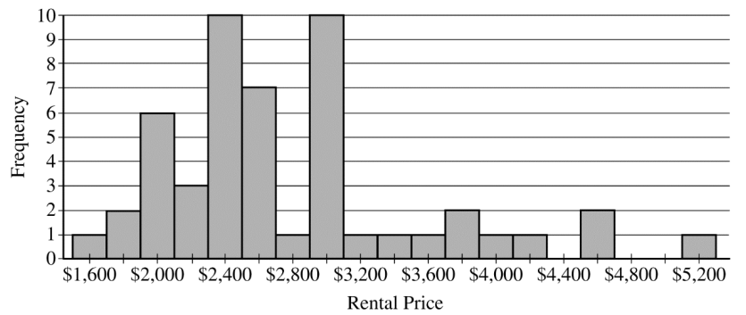

.. _sampling_distribution_classwork:

======================
Sampling Distributions
======================

Sample Proportion
=================

.. topic:: Sampling Distribution for Sample Proportion

	If :math:`\mathcal{X}_i \sim \text{Bern}(p)` for :math:`i = 1, 2, ..., n` and the following conditions are met,
	
	1. :math:`n \cdot p \geq 10`
	2. :math:`n \cdot (1 - p) \geq 10`
	
	The random variable, :math:`\hat{p} = \frac{\mathcal{X}_1 + \mathcal{X}_2 + ... + \mathcal{X}_n}{n}` has the following distribution,
	
	.. math::
	
		\hat{p} \sim \mathcal{N}(n \cdot p, \sqrt{\frac{p \cdot (1 - p)}{n}}) 

Difference of Proportions
-------------------------

.. topic:: Sampling Distribution for Difference of Sample Proportions

	If :math:`\mathcal{X}_i \sim \text{Bern}(p_x)` for :math:`i = 1, 2, ..., n_x` and the following conditions are met,
	
	1. :math:`n_x \cdot p_x \geq 10`
	2. :math:`n_x \cdot (1 - p_x) \geq 10`
	3. :math:`n_y \cdot p_y \geq 10`
	4. :math:`n_y \cdot (1 - p_y) \geq 10`
	
	The random variable, :math:`\hat{p}_x - \hat{p}_y` has the following distribution,
	
	.. math::
	
		\hat{p} \sim \mathcal{N}(n_x \cdot p_x - n_y \cdot p_y, \sqrt{\frac{p_x \cdot (1 - p_x)}{n_x} + \frac{p_y \cdot (1 - p_y)}{n_y}} ) 
	

Sample Mean
===========

.. topic:: Sampling Distribution for the Sample Mean

	If :math:`\mathcal{X}_i \sim \mathcal{N}(\mu, \sigma)` for :math:`i = 1, 2, ..., n` **and** :math:`n \geq 30`, then the random variable :math:`\bar{\mathcal{X}} = \frac{\mathcal{X}_1 + \mathcal{X}_2 + ... + \mathcal{X}_n}{n}` has the following distribution, 
	
	.. math::
	
		\bar{\mathcal{X}} \sim \mathcal{N}(\mu, \frac{\sigma}{\sqrt{n}})
		
Difference of Means
-------------------

.. topic:: Sampling Distribution for Difference of Sample Means

	If :math:`\mathcal{X}_i \sim \mathcal{N}(\mu_x, \sigma_y)` for :math:`i = 1, 2, ..., n_x`, :math:`\mathcal{Y}_i \sim \mathcal{N}(\mu_y, \sigma_x)` for :math:`i = 1, 2, ..., n_y` **and** :math:`min(n_1, n_2) \geq 30`, then the random variable :math:`\bar{\mathcal{X}} - \bar{\mathcal{Y}}` has the following distribution, 
	
	.. math::
	
		\bar{\mathcal{X}} - \bar{\mathcal{Y}} \sim \mathcal{N}(\mu_x - \mu_y, \sqrt{ \frac{{\sigma_x}^2}{n_x} + \frac{{\sigma_y}^2}{n_y}})
	
Problems
========

Sampling Distributions
----------------------

1. **Devore, Berk, 2007**

There are two traffice lights on the way to work. Let :math:`\mathcal{X}_1` be the number of lights that are red, requiring a stop, and suppose the distribution of :math:`\mathcal{X}_1` is as follows,

+----------------+--------+---------+--------+
| :math:`x_1`    |   0    |    1    |    2   |
+----------------+--------+---------+--------+
| :math:`p(x_1)` |  0.2   |   0.5   |   0.3  |
+----------------+--------+---------+--------+

Let :math:`\mathcal{X}_2` be the numebr of lights that are red on the way home; :math:`\mathcal{X}_2` is independent of :math:`\mathcal{X}_1`. Assume that :math:`\mathcal{X}_2` has the same distribution as :math:`\mathcal{X}_1`, so that :math:`\mathcal{X}_1` and :math:`\mathcal{X}_2` is a random sample of size :math:`n=2`.

	a. Let :math:`\mathcal{T} = \mathcal{X}_1 + \mathcal{X}_2`. Find the probability distribution of :math:`\mathcal{T}`. 
	
	b. Calculate :math:`\mu_{T}`. How does it relate to :math:`\mu`, the population mean?
	
	c. Calculate :math:`{\sigma_T}^2`. How does it relate to :math:`\sigma^2`, the population variance?
	
2. **Moore, 2007**

Let :math:`\mathcal{X}` be the number of students absent from AP Statistics on a given day. Suppose the distribution of :math:`\mathcal{X}` is as follows,

+--------------+--------+---------+--------+---------+
| :math:`x`    |   1    |    2    |    3   |    4    |
+--------------+--------+---------+--------+---------+
| :math:`p(x)` |  0.4   |   0.3   |   0.2  |   0.1   |
+--------------+--------+---------+--------+---------+

	a. Consider a random sample of size :math:`n=2` (two days), and let :math:`\bar{\mathcal{X}}` be the sample mean of the number of absent students. Obtain the probability distribution of :math:`\bar{\mathcal{X}}`.
	
	b. What is the probability the average number of absent students for a sample of 2 is atleast 3 absent students?
	
	c. Is the sample mean an unbiased estimator?
	
	d. Consider again a random sample of size :math:`n=2`, and let :math:`\mathcal{R}` be the sample range of the number of absent students. Obtain the probability distribution of :math:`\mathcal{R}`.

	e. What is the probability the sample range for a sample of 2 is at most 2 absent students? 
	
	e. Is the sample range an unbiased estimator?
	
Sample Proportions
------------------

1. **Handedness**

`Approximately 10% of the world's population is left handed <https://en.wikipedia.org/wiki/Handedness>`_. There are 347 students in the Bishop Walsh student body. Let :math:`\hat{p}` represent the proportion of Bishop Walsh students who are left handed. 

	a. Calculate and interpret the mean and standard deviation of the sampling distribution of :math:`\hat{p}`.
	
	b. Verify the conditions for inference are met. 
	
	c. Describe the shape of the samping distribution of :math:`\math{p}`.
	
	d. Assuming the Wikipedia article referenced above is correct, what is the probability more than 40 students at Bishop Walsh are left-handed?
	
2. **DVD Players**

`According to a survey conducted in 2022, 38% of 18-29 year olds from the United States live in a household that owns a DVD player <https://www.statista.com/statistics/369955/people-living-in-households-that-own-a-blu-ray-dvd-player-usa/>`_. Suppose you randomly sample 40 Americans between the ages of 18 and 29 years old. What is the probability the proportion of the people from this sample who live in a household with a DVD player will be greater than 45%? 

3. **Illuminati**

`According to a 2019 report by Business Insider, 15% of registered voters in the United States believe the Illuminati secretly controls world events <https://www.businessinsider.com/over-1-in-10-registered-voters-believe-the-illuminati-exists-2019-7>`_. Suppose you randomly sample 50 registered voters living in the US. How likely is it this sample will contain less than 10% of people who believe in the Illuminati?

4. **Coins**

Suppose you flip a coin 100 times. If you allow for a 5% probability of being wrong, how many heads in a sample of 100 would you need to observe before you had convincing evidence the probability of heads for a single coin flip is greater than 50%?

Difference of Sample Proportions
--------------------------------

1. **Athletics**

At Bishop Walsh, the administration claims 75% of high school students participate in atleast one extra curricular activity, while 69% of middle students participate in atleast one extracurricular activity. 

During middle school lunch, Mr. Moore asks a random sample of 35 students whether or not they participate in atleast one extracurricular activity. During highschool lunch, Mr. Moore asks the same question to a random sample of 38 high school students.
 
Let :math:`\hat{p}_{\text{hs}}` represent the proportion of high school students in Mr. Moore's sample that participate in atleast one extracurricular activity. Let :math:`\hat{p}_{\text{ms}}` represent the proporition of middle school students in Mr. Moore's sample that participate in atleast one extracurricular activity.

	a. What is the shape of the sampling distribution :math:`\hat{p}_{\text{hs}} - \hat{p}_{\text{ms}}`? Justify your answer.
	
	b. Find and interpret the mean of the sampling distribution for the difference of sample proportions.
	
	c. Find and interpret the standard deviation of the sampling distribution for the difference of sample proportions.
	
	d. Assuming the administration's claim is true, what is the probability that the proportion of highschool students who participate in atleast one extracurricular is atleast 10% higher than the proportion of middle-school students who participate in  atleast one extracurricular?
	
	e. Suppose the difference in proportions is exactly 0.10. Based on your result to *part d* does this give you reason to doubt the administration's claim?

2. **Skittles and M&Ms**

The manufacturers of Skittles claim 20% of each bag of Skittles is red. The manufacturers of M&M's claim 25% of each bag of M&Ms is red. Each bag of M&Ms contains 56 pieces. Each bag of Skittles contains 54 pieces. Assuming the manufacturers' claim to be true, what is the probability the proportion of red M&Ms in a bag will exceed the proportion of red Skittles in a bag?

Sample Means
------------

1. **Devore, Berk, 2007**

The lifetime of a certain brand of battery is normally distributed with a mean of 10 hours and a standard deviation of 1 hour. There are four batteries to a package. If you buy a single package, what is the probability the average lifetime of all of the batteries in the package exceeds 11 hours?

2. **Devore, Berk, 2007**

There are five students in Mr. Moore's AP Statistics. On the basis of his many years of experience, Mr. Moore knows the time it takes to grade a randomly chosen examination paper is normally distributed with a mean of 10 minutes and a standard deviation of 2.5 minutes. 

     a. What is the probability the average amount of time Mr. Moore spends grading the latest exams is less than 8 minutes?

     b. The latest Dragonball Z is on at 8 pm on the Cartoon Network. If Mr. Moore starts grading at 7:15 PM, what is the probability Mr. Moore misses part of the epic battle between Goku and Frieza?

Difference of Means
-------------------
	
1. **Chemistry**

Mr. Myers notices the chemistry students in his morning class are measuring different pH values for a chemical compound than the students in his afternoon class. There are 10 students in each class. Mr. Myers decides to calculate the average pH of each class and compare them.

Suppose the pH measured by a randomly selected chemistry student is normally distributed with a mean pH of 5.00 and a standard deviation of 0.2. What is the probability the difference of the class averages for the pH will be within 0.1 of each other?

A.P. Exam Practice
==================

1. **2006, Free Response, #3**

The depth from the surface of Earth to a refracting layer beneath the surface can be estimated using methods developed by seismologists. One method is based on the time required for vibrations to travel from a distant explosion to a receiving point. The depth measurement **M** is the sum of the true depth **D** and the random measurement error **E**. That is, :math:`M = D + E`. The measurement error **E** is assumed to be normally distributed with mean 0 feet and standard deviation 1.5 feet.

	a. If the true depth at a certain point is 2 feet, what is the probability that the depth measurement will be negative?

	b. Suppose three independent depth measurements are taken at the point where the true depth is 2 feet. What is the probability that at least one of these measurements will be negative?

	c. What is the probability that the mean of the three independent depth measurements taken at the point where the true depth is 2 feet will be negative?

2. **2004, Free Response Form B, #3**

Trains carry bauxite ore from a mine in Canada to an aluminum processing plant in northern New York state in hopper cars. Filling equipment is used to load ore into the hopper cars. When functioning properly, the actual weights of ore loaded into each car by the filling equipment at the mine are approximately normally distributed with a mean of 70 tons and a standard deviation of 0.9 ton. If the mean is greater than 70 tons, the loading mechanism is overfilling.

	a. If the filling equipment is functioning properly, what is the probability that the weight of the ore in a randomly selected car will be 70.7 tons or more? Show your work.

	b. Suppose that the weight of ore in a randomly selected car is 70.7 tons. Would that fact make you suspect that the loading mechanism is overfilling the cars? Justify your answer.

	c. If the filling equipment is functioning properly, what is the probability that a random sample of 10 cars will have a mean ore weight of 70.7 tons or more? Show your work.

	d. Based on your answer in part (c), if a random sample of 10 cars had a mean ore weight of 70.7 tons, would you suspect that the loading mechanism was overfilling the cars? Justify your answer.

3. **2007, Free Response, #3**

Big Town Fisheries recently stocked a new lake in a city park with 2,000 fish of various sizes. The distribution of the lengths of these fish is approximately normal.

	a. Big Town Fisheries claims that the mean length of the fish is 8 inches. If the claim is true, which of the following would be more likely?

		A random sample of 15 fish having a mean length that is greater than 10 inches

	or

		A random sample of 50 fish having a mean length that is greater than 10 inches

	Justify your answer.

	b. Suppose the standard deviation of the sampling distribution of the sample mean for random samples of size 50 is 0.3 inch. If the mean length of the fish is 8 inches, use the normal distribution to compute the probability that a random sample of 50 fish will have a mean length less than 7.5 inches.

	c. Suppose the distribution of fish lengths in this lake was nonnormal but had the same mean and standard deviation. Would it still be appropriate to use the normal distribution to compute the probability in *part b* ? Justify your answer.

5. **2009, Free Response, #2**

A tire manufacturer designed a new tread pattern for its all-weather tires. Repeated tests were conducted on cars of approximately the same weight traveling at 60 miles per hour. The tests showed that the new tread pattern enables the cars to stop completely in an average distance of 125 feet with a standard deviation of 6.5 feet and that the stopping distances are approximately normally distributed.

	a. What is the 70th percentile of the distribution of stopping distances?

	b. What is the probability that at least 2 cars out of 5 randomly selected cars in the study will stop in a distance that is greater than the distance calculated in *part a*?

	c. What is the probability that a randomly selected sample of 5 cars in the study will have a mean stopping distance of at least 130 feet?

6. **2010, Free Response, #2**

A local radio station plays 40 rock-and-roll songs during each 4-hour show. The program director at the station needs to know the total amount of airtime for the 40 songs so that time can also be programmed during the show for news and advertisements. The distribution of the lengths of rock-and-roll songs, in minutes, is roughly symmetric with a mean length of 3.9 minutes and a standard deviation of 1.1 minutes.

	a. Describe the sampling distribution of the sample mean song lengths for random samples of 40 rock-and-roll songs.

	b. If the program manager schedules 80 minutes of news and advertisements for the 4-hour (240-minute) show, only 160 minutes are available for music. Approximately what is the probability that the total amount of time needed to play 40 randomly selected rock-and-roll songs exceeds the available airtime?

7. **2019, Free Response, #6**

Emma is moving to a large city and is investigating typical monthly rental prices of available one-bedroom apartments. She obtained a random sample of rental prices for 50 one-bedroom apartments taken from a Web site where people voluntarily list available apartments.

	a. Describe the population for which it is appropriate for Emma to generalize the results from her sample.
	
The distribution of the 50 rental prices of the available apartments is shown in the following histogram.

	
Use this histogram to answer the following questions.

	b. Emma wants to estimate the typical rental price of a one-bedroom apartment in the city. Based on the distribution shown, what is a disadvantage of using the mean rather than the median as an estimate of the typical rental price?
	
	c. Instead of using the sample median as the point estimate for the population median, Emma wants to use an interval estimate. However, computing an interval estimate requires knowing the sampling distribution of the sample median for samples of size 50. Emma has one point, her sample median, in that sampling distribution. Using information about rental prices that are available on the Web site, describe how someone could develop a theoretical sampling distribution of the sample median for samples of size 50.

Because Emma does not have the resources to develop the theoretical sampling distribution, she estimates the sampling distribution of the sample median using a process called bootstrapping. In the bootstrapping process, a computer program performs the following steps,

- Take a random sample, with replacement, of size 50 from the original sample.
- Calculate and record the median of the sample.
- Repeat the process to obtain a total of 15,000 medians.

Emma ran the bootstrap process, and the following frequency table is the bootstrap distribution showing her results of generating 15,000 medians.

.. image:: ../../../assets/imgs/classwork/2019_apstats_frp_06b.png
	:align: center
	
The bootstrap distribution provides an approximation of the sampling distribution of the sample median. A confidence interval for the median can be constructed using a percentage of the values in the middle of the bootstrap distribution.

	d. Use the frequency table to find the following.
	
		i. Value of the 5th percentile:
		
		ii. Value of the 95th percentile:

	e. Find the percentage of bootstrap medians in the table that are equal to or between the values found in *part d*.
	
	f. Use your values from *parts d* and *e* to construct and interpret a confidence interval for the median rental price.
